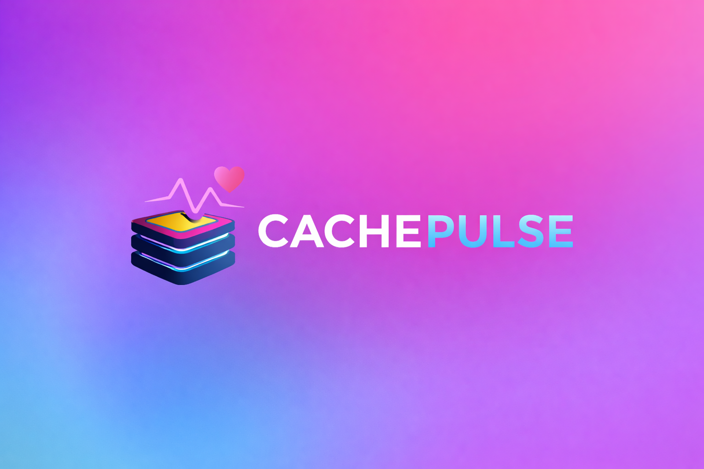
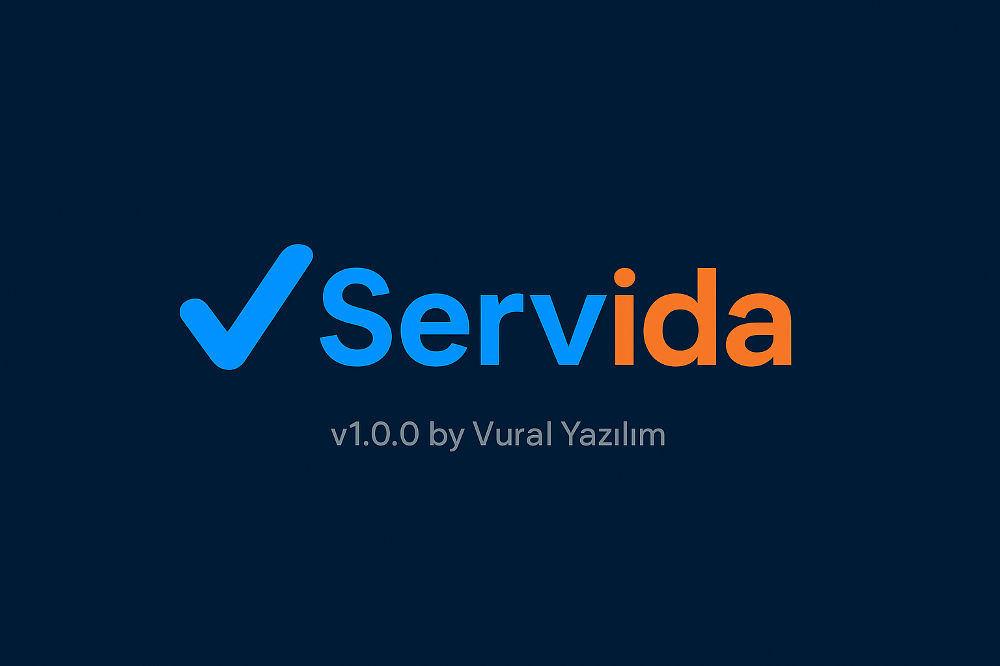

  

  
  
  
  

---

## 👨‍💻 About Me

- **Focus**: Web, Cloud, DevOps and Mobile (Flutter)
- **Things I enjoy**: Modern frontend architectures, scalable backend design, observability, CI/CD

---

## 🧰 Tech Stack (Categorized)

### 🌐 Web

  
  
  
  
  
  
  
  

### 🗄️ Database Technologies (DB)

  
  
  

### ☁️ Cloud Technologies

  
  
  
  
  

### ⚙️ DevOps & Observability

  
  
  
  
  
  
  
  

### 📱 Mobile Development

  

---

## 📊 GitHub Statistics

  
  

---

## ⭐ Featured Projects

<table>
  <tr>
    <td width="50%" align="center">
      
       
      <a href="https://myedura.com/presentation" target="_blank">
        <strong>Edura</strong>
      </a>
       
      Edura is a comprehensive course tracking and management system developed for educational institutions.
    </td>
    <td width="50%" align="center">
      
       
      <a href="https://github.com/CachePulse/cachepulse" target="_blank">
        <strong>CachePulse</strong>
      </a>
       
      CachePulse is a memory hierarchy simulator designed to analyze access latency and hit ratios across cache, RAM, and disk layers.
    </td>
  </tr>
  <tr>
    <td width="50%" align="center">
      
       
      <a href="https://github.com/Marmara-Biltek/marmara-biltek" target="_blank">
        <strong>Marmara-Biltek</strong>
      </a>
       
      Official website project for Marmara Science and Technology Club.
    </td>
    <td width="50%" align="center">
      
       
      <a href="https://github.com/Servida/servida-web" target="_blank">
        <strong>Servida</strong>
      </a>
       
      Service Management System
    </td>
  </tr>
  <tr>
    <td width="50%" align="center" colspan="2">
      
       
      <a href="https://github.com/CariStok/caristok-web" target="_blank">
        <strong>CariStok</strong>
      </a>
       
      Accounts Receivable and Inventory Management System
    </td>
  </tr>
</table>
